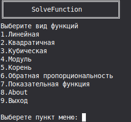
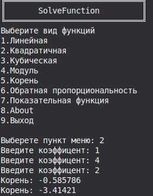

# Solver-Function (Polymorphic Math Engine)

A command-line application designed for mathematical analysis and equation solving. This project serves as a technical showcase implementing Object-Oriented Programming (OOP) patterns, runtime polymorphism, RAII resource lifecycle management, and type-safe input stream validation in C++17.

The application architecture separates the user interface and terminal management layers from the core mathematical computation engine.

## Preview

### Main Menu Interface


### Equation Solving Execution


## Technical Stack & Environment
* Language Standard: C++17
* Memory Management: RAII / Smart Pointers (std::unique_ptr)
* Build System: CMake
* Target OS: Linux, Windows, macOS

---

## Architecture & Design Patterns

### 1. Factory Method Pattern
Object instantiation is encapsulated within the FunctionFactory class. The application lifecycle manager interacts with mathematical models exclusively through the abstract MathFunction base interface via runtime polymorphism. This architecture allows the extension of supported mathematical functions without altering the control flow or menu execution logic.

### 2. Resource Management & Memory Safety
Manual memory management, raw allocations (new), and explicit deletions (delete) are completely eliminated. The lifecycles of polymorphically invoked engine sub-components are governed via std::unique_ptr smart containers, preventing resource leaks and ensuring deterministic destruction.

### 3. Type-Safe Stream Validation Engine
Console input parsing is handled by a generic template-based validation loop inputAndCheck<T>. It decouples custom validation predicates from low-level stream recovery. The subsystem detects stream corruption, flushes the std::cin buffer using std::numeric_limits, resets flags via .clear(), and re-prompts the user without interrupting application execution.

### 4. Precision Guarding
Numerical evaluations against zero boundaries, domain limits, or discriminant thresholds utilize an epsilon constant (const double EPS = 1e-9) to mitigate floating-point inaccuracies inherent in standard IEEE 754 representations.

---

## Function Implementation Status

The engine exposes four virtual operation vectors (Solve(), Derivative(), Integrate(), Analysis()) inside the abstract interface. The matrix below outlines the current structural state of the functional components:

| Function Class | Analytical Target | Solve() | Derivative / Integrate / Analysis |
| :--- | :--- | :--- | :--- |
| **Linear** | kx + b = 0 | Implemented | Planned (Phase 2) |
| **Quadratic** | ax² + bx + c = 0 | Implemented (Real Roots) | Planned (Phase 2) |

Note: Support for Cubic, Absolute Value, Square Root, and Exponential functions is structured in the core architecture and will be integrated into future releases.

---

## Code Showcase: Stream Validation Engine

The snippet below demonstrates secure, exception-free command-line interaction by accepting a custom lambda predicate to isolate input rules:

```cpp
template<typename T, typename Predicate> 
T inputAndCheck(const std::string& message, const std::string& rangeErrorMessage, Predicate isValid)
{
    T num;
    while (true)
    {
        std::cout << message;
        if (!(std::cin >> num)) {
            std::cin.clear();
            std::cin.ignore(std::numeric_limits<std::streamsize>::max(), '\n');
            std::cout << "Ошибка! Введите число\n" << std::endl;
            continue;
        }
        if (!isValid(num)) {
            std::cin.clear();
            std::cin.ignore(std::numeric_limits<std::streamsize>::max(), '\n');
            std::cout << rangeErrorMessage << "\n" << std::endl;
            continue;
        }
        std::cin.ignore(std::numeric_limits<std::streamsize>::max(), '\n');
        return num;
    }
}
```

---

## Project Roadmap

### Phase 1: Code Architecture Modernization (In Progress)
* [x] Build System Automation: Integrated CMake for cross-platform compilation.
* [x] Repository Hygiene: Configured explicit deployment guards via .gitignore.
* [ ] Monolith Decomposition: Extract the single-file structure (SolverFunction-OOP.cpp) into isolated /include (.hpp) and /src (.cpp) directory layers.

### Phase 2: Mathematical Engine Extension
* [ ] Calculus Subsystem: Implement analytical/numerical differentiation (Derivative()) and numerical integration routines (Integrate()).
* [ ] Complex Numbers Support: Integrate std::complex into the QuadraticFunction pipeline to resolve negative discriminant (D < 0) boundaries.
* [ ] New Function Vectors: Complete concrete factory overrides for Cubic, Square Root, and Inverse Proportionality classes.

### Phase 3: UX & Infrastructure Refinement
* [ ] Persistent Application Loop: Redesign the lifecycle manager inside App::Run() to enable returning to the main menu instead of immediate process termination.
* [ ] Localization Abstraction: Separate console messaging vectors into an independent locale block to support English and Russian interfaces.

---

## Compilation and Execution

### Using CMake (Recommended)

```bash
mkdir build && cd build
cmake ..
cmake --build .
./solver-app
```

### Manual Compilation

```bash
# Compilation using Clang LLVM toolchain
clang++ -std=c++17 SolverFunction-OOP.cpp -o solver-app
./solver-app

# Compilation using GNU Compiler Collection (GCC)
g++ -std=c++17 SolverFunction-OOP.cpp -o solver-app
./solver-app
```

---

## License

This project is open-source software licensed under the terms of the MIT License. See below for details:

```text
MIT License

Copyright (c) 2026 Nainkoo

Permission is hereby granted, free of charge, to any person obtaining a copy
of this software and associated documentation files (the "Software"), to deal
in the Software without restriction, including without limitation the rights
to use, copy, modify, merge, publish, distribute, sublicense, and/or sell
copies of the Software, and to permit persons to whom the Software is
furnished to do so, subject to the following conditions:

The above copyright notice and this permission notice shall be included in all
copies or substantial portions of the Software.

THE SOFTWARE IS PROVIDED "AS IS", WITHOUT WARRANTY OF ANY KIND, EXPRESS OR
IMPLIED, INCLUDING BUT NOT LIMITED TO THE WARRANTIES OF MERCHANTABILITY,
FITNESS FOR A PARTICULAR PURPOSE AND NONINFRINGEMENT. IN NO EVENT SHALL THE
AUTHORS OR COPYRIGHT HOLDERS BE LIABLE FOR ANY CLAIM, DAMAGES OR OTHER
LIABILITY, WHETHER IN AN ACTION OF CONTRACT, TORT OR OTHERWISE, ARISING FROM,
OUT OF OR IN CONNECTION WITH THE SOFTWARE OR THE USE OR OTHER DEALINGS IN THE
SOFTWARE.
```

